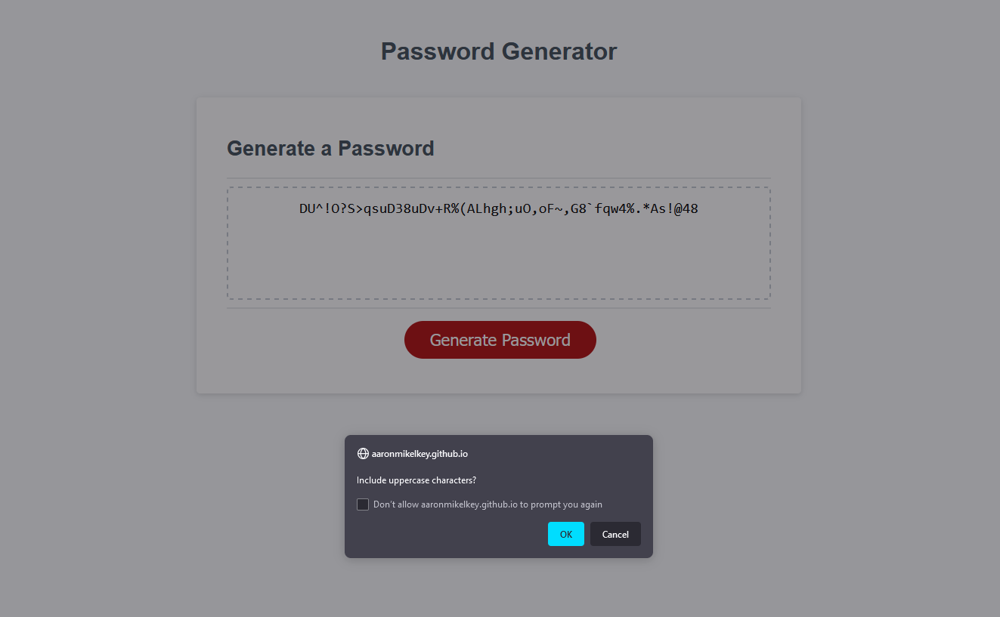

# 03 JavaScript: Password Generator

This is an app to generate a password.  The user may select a length between 8 and 128 characters, and then select one or more types of characters to be used in the password.


---

## Use

To use this, simply click the generate password button.  A series of prompts will give you the options available and once selected the password will be shown in the box.


**AT LEAST ONE CHARACTER TYPE MUST BE SELECTED**

---

## Character Types

1. Uppercase Letters: 
	```
	QWERYTUIOPASDFGHJKLZXCVBNM
	```
2. Lowercase Letters:
	```
	qwertyuiopasdfghjklzxcvbnm
	```
3. Numbers: 
	```
	1234567890
	```
4. Special Characters: 
	```
	!@#$%^&*()-_=+~`|;:<,>.?/
	```


---

## Generation

The selected characters are added to an array, and then a character is selected using `Math.Random()` and pushed to an array.  The array is then joined to a string and added to the HTML.

See the [MDN Web Docs on Math.Random()](https://developer.mozilla.org/en-US/docs/Web/JavaScript/Reference/Global_Objects/Math/random) for security warnings.  This is simply an example project and should not be used for important security concerns.

---

## Sample Image:

